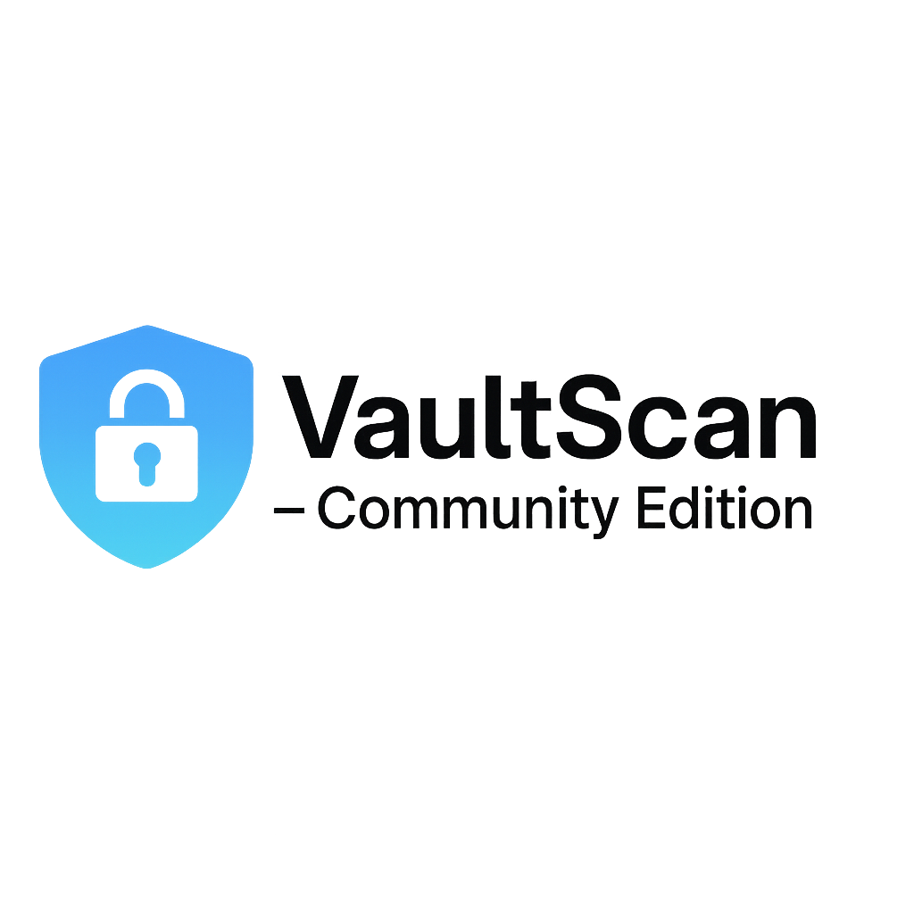

# VaultScan – Community Edition (v1.1)

<p align="center">
  
</p>


---

## 🚀 About VaultScan

**VaultScan** is a fast, lightweight, privacy-first secrets and credential leak detection tool for code repositories.

Designed for DevOps, Cloud Security, and Development teams to **prevent accidental secret exposures** before they become million-dollar breaches.

Built for local, offline-first scanning with modular design for future cloud expansion.

---

## ✨ What's New in v1.1

- Full directory recursive scanning.
- Smart file filtering (`.py`, `.js`, `.yaml`, `.tf`, etc.).
- Secret detection inside real code, not just dummy files.
- Beautiful Rich CLI output.
- Modular, future-ready codebase.

---

## 🎯 Key Features

- 🔍 Scans local code repositories for leaked credentials.
- 🔒 100% Privacy-first: No data leaves your machine.
- 🎨 Beautiful Rich CLI output for better visibility.
- ⚡ Lightweight and fast scanning.
- 📂 Supports ignore patterns via `.vaultscanignore`.
- 🛡️ Risk scoring for better secret prioritization.

---

## 🛠️ Installation

Clone the repository:

```bash
git clone https://github.com/[your-username]/vaultscan-prototype-community-edition.git
cd vaultscan-prototype-community-edition
```

Install dependencies:

```bash
pip install -r requirements.txt
```

---

## 🚀 Usage

```bash
python -m vaultscan.main --path ./path/to/your/codebase
```

Example:

```bash
python -m vaultscan.main --path ./projects/my-app
```

---

## 🛡️ Supported Secret Patterns (MVP)

- AWS Access Keys
- Slack Tokens
- Generic API Keys

*(More patterns can be added easily in future versions.)*

---

## 📂 Example `.vaultscanignore`

Create a `.vaultscanignore` in your repo root to skip scanning certain files or folders:

```
node_modules/
tests/
*.jpg
*.png
*.pdf
```

---

## 📜 License

This project is licensed under the [Apache 2.0 License](LICENSE).

---

## ✍️ Author

Developed by **Pavan Gajjala**  
*Focused on building privacy-first, security-focused DevOps tools.*

---

## 🛠️ Future Roadmap (Private Advanced Version)

- GitHub/GitLab/Bitbucket API integrations
- AWS/GCP/Kubernetes secret scanning
- Automated Slack/Email alerts
- Cloud dashboard and scheduling
- SaaS enterprise version

---

# 📢 DISCLAIMER

> This is the **VaultScan – Community Edition (v1.1)** built for public open-source contribution, personal learning, and DevOps community support.  
>  
> **VaultScan Pro and Enterprise Editions** are under private development for future commercial release.

# vaultscan-community
A privacy-first secret leak detection tool for DevOps, Cloud, and Security teams.  
Built for scalable, offline-first scanning, future-proofed for multi-cloud and enterprise environments.